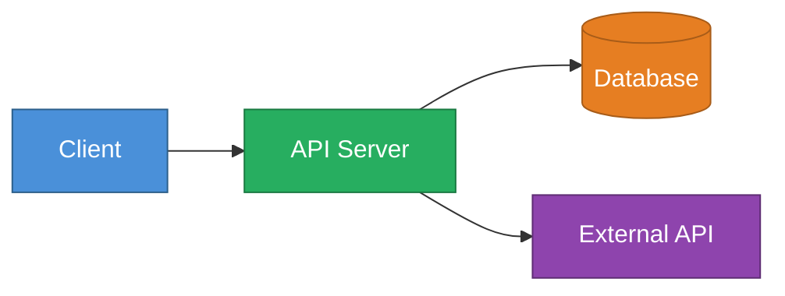

# README Sync Skill

まず $ARGUMENTS と既存の README の有無を確認し、**モードを判定**する。

| 条件 | モード |
|---|---|
| README が存在しない / 新規作成を明示 | → [新規作成モード](#新規作成モード) |
| README が存在 / 変更反映を明示 | → [更新モード](#更新モード) |

---

## 新規作成モード

### Step 1: プロジェクト全体を把握する

以下を順に実行してプロジェクトの構造・技術スタック・設定を理解する。

```
プロジェクト構造:     !`find . -maxdepth 3 -not -path '*/node_modules/*' -not -path '*/.git/*' -not -path '*/__pycache__/*'`
パッケージ定義:       !`cat package.json 2>/dev/null || cat build.gradle 2>/dev/null || cat pom.xml 2>/dev/null || cat pyproject.toml 2>/dev/null || cat Cargo.toml 2>/dev/null || echo "該当なし"`
Docker構成:          !`cat docker-compose.yml 2>/dev/null || cat Dockerfile 2>/dev/null || echo "該当なし"`
環境変数サンプル:     !`cat .env.example 2>/dev/null || cat .env.sample 2>/dev/null || echo "該当なし"`
CI設定:              !`ls .github/workflows/ 2>/dev/null || echo "該当なし"`
```

### Step 2: README を生成する

以下の構成で `README.md` を作成する。不要なセクションは省略してよい。

---

````markdown
# {プロジェクト名}

> 1〜2行でプロジェクトの目的を端的に説明

## 概要

プロジェクトが解決する課題・提供する価値を3〜5文で記述。

## アーキテクチャ（外部リソースや複数サービスが絡む場合）

外部サービス・DB・キャッシュ・他マイクロサービスとの連携がある場合のみ Mermaid で図示する。
色付きで視覚的にわかりやすく記述する。



## 技術スタック

| カテゴリ | 技術 | 備考 |
|---|---|---|
| 言語 | | |
| フレームワーク | | |
| DB | | |
| インフラ | | |

特殊・新規採用技術がある場合は参考URLを記載：
- [技術名](URL) — 採用理由・ポイント

## 必要な環境

- 言語ランタイムのバージョン（例: Node.js 20+, Python 3.11+, Java 21+）
- その他必須ツール

## セットアップ

### インストール

```bash
# 依存パッケージのインストールコマンド
```

### 環境変数

`.env.example` をコピーして設定する：

```bash
cp .env.example .env
```

| 変数名 | 必須 | 説明 | デフォルト |
|---|---|---|---|
| `DATABASE_URL` | ✅ | DB接続文字列 | — |
| `PORT` | | サーバーポート | `8080` |

## 実行方法

### 開発環境

```bash
# 開発サーバー起動コマンド
```

### 本番環境 / Docker

```bash
# Docker起動コマンド（docker-compose がある場合）
docker compose up -d
```

## ビルド

```bash
# ビルドコマンド
```

## テスト

```bash
# テスト実行コマンド
# 単体テスト
# E2Eテスト（存在する場合）
```

## API リファレンス（APIサーバーの場合）

主要エンドポイントの確認方法を curl で記載する。

```bash
# ヘルスチェック
curl http://localhost:8080/health

# 例: リソース取得
curl -H "Authorization: Bearer {token}" \
     http://localhost:8080/api/v1/resources

# 例: リソース作成
curl -X POST http://localhost:8080/api/v1/resources \
     -H "Content-Type: application/json" \
     -d '{"key": "value"}'
```

## ディレクトリ構成

```
{プロジェクト名}/
├── src/
│   └── ...
├── tests/
└── ...
```

## 備考

- 特殊な設計判断・既知の制約などがあれば記載
````

---

## 更新モード

### Step 1: 変更内容を把握する

```
現在のREADME:   !`cat README.md`
ブランチ差分:   !`git diff main...HEAD --stat`
詳細差分:       !`git diff main...HEAD`
コミット一覧:   !`git log main..HEAD --oneline`
```

> ベースブランチが `main` でない場合は適宜読み替える。

### Step 2: 更新箇所を判定する

差分を分析し、以下の観点でREADMEの更新要否を判断する：

| 変更の種類 | 更新対象セクション |
|---|---|
| 新しいエンドポイント追加 | API リファレンス |
| 環境変数の追加・変更 | 環境変数テーブル |
| 依存関係・技術スタック変更 | 技術スタック・セットアップ |
| ビルド/実行コマンドの変更 | 実行方法・ビルド |
| アーキテクチャの変更 | 概要・Mermaid図 |
| テスト追加・変更 | テスト |

### Step 3: 最小限の差分で更新する

- 変更が必要なセクションのみ更新する（他は触らない）
- 既存の文体・フォーマットを踏襲する
- 更新後、**何を変えたか** を箇条書きで報告する

---

## 共通方針

- **簡潔さ優先**。開発者が手早く動かせることをゴールにする
- Mermaid図は外部連携・複数サービスがある場合のみ使用。`classDef` で色付けして視認性を上げる
- コードブロックには必ず言語指定をつける（` ```bash `, ` ```kotlin ` など）
- テーブルは左揃えで統一
- $ARGUMENTS に追加指示がある場合はそちらを優先する
